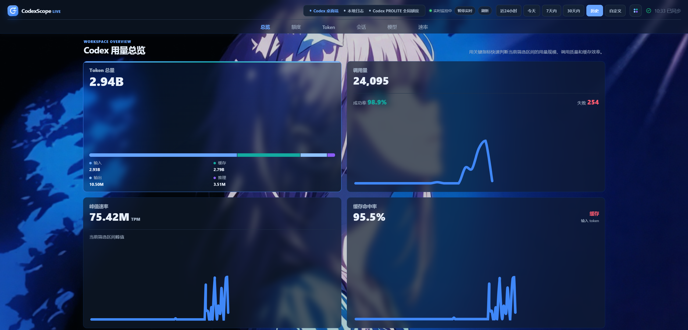
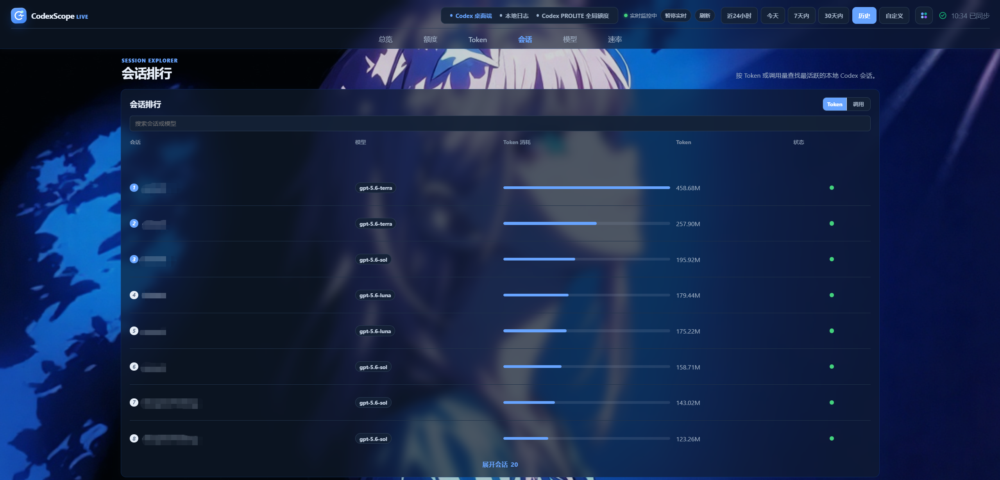

# CodexScope-Live

English | [简体中文](README.zh-CN.md)

CodexScope Live is a local-first dashboard for understanding Codex usage from local session logs. It turns token usage, quota status, model mix, session activity, request distribution, cache hits, and estimated cost into a desktop-friendly view.

### Usage overview

### Session ranking

## Attribution

This repository is a local derivative and personal adaptation of the open-source **CodexScope** project. The original project was created and published by **[JUk1-GH](https://github.com/JUk1-GH)**.

- Original repository: [JUk1-GH/CodexScope](https://github.com/JUk1-GH/CodexScope)
- Original license: [MIT](LICENSE)

The original attribution and license are retained. This repository is an independent personal version and is not the upstream project.

## What it does

CodexScope Live reads the usage metadata already present in local Codex JSONL session logs. It does not connect to a Codex account, upload prompts, or run a hosted backend.

The project has two modes:

| Mode | Best for | How it works |
| --- | --- | --- |
| Static preview | Quickly viewing the interface | Open `index.html`; bundled sample data is used when no local export exists. |
| Local live dashboard | Watching local usage while Codex is running | A small Rust server serves the page, watches the session directory, regenerates local exports, and sends refresh events through Server-Sent Events (SSE). |

## Features

- Cumulative input, cached, output, and reasoning token trends
- Absolute and logarithmic chart views
- Presets for the last 24 hours, today, 7 days, 30 days, and all history
- Custom date ranges backed by the raw local event catalog
- Request and token distribution charts
- Quota and risk status from local `rate_limits` events when available
- Session and model rankings with local search filters
- Estimated cost by model and token type, with USD and optional CNY display
- Live refresh toggle, connection status, and in-place manual or automatic data updates without reloading the page
- Startup recovery that waits for the real `data.js` instead of remaining on sample data while the Go generator finishes
- Six true tab pages for overview, quota, Token analytics, sessions, models and cost, and rate distribution
- Adaptive first-screen density with a 2-by-2 overview grid and charts and rankings that expand into available vertical space
- A redesigned CodexScope-Live pulse logo with independent light/dark modes, four palettes, and Acrylic, Liquid Glass, Matte, and Translucent surface styles
- Local custom backgrounds stored in the browser, with adjustable overlay strength and blur; images are never written into the repository or uploaded
- URL hash navigation with refresh persistence, browser history support, and keyboard arrow/Home/End controls
- Local-only data generation from `~/.codex/sessions`
- Responsive desktop-focused interface with no hosted telemetry

## Quick start

### Windows portable live dashboard (recommended)

Regular users should download `CodexScope-Live-v0.3.0-Windows-x64.zip` and its matching `.sha256` file from [GitHub Releases](https://github.com/ChampionYuCheng/CodexScope-Live/releases). Do not use GitHub's automatically generated `Source code` archives.

1. Extract the entire ZIP.
2. Double-click `CodexScope-Live.exe`.
3. The app opens `http://127.0.0.1:48173/` automatically without leaving a PowerShell or Command Prompt window open.
4. Use **Exit app** in the dashboard header when you want to stop the local service.

The portable package includes the Rust live server and the precompiled Go data generator. It does not require Node.js, Go, Rust, or manually configured environment variables. The Windows server uses the GUI subsystem, opens the browser through the Windows shell, and runs its generator without console popups. Startup failures are shown in a native dialog and recorded in `%LOCALAPPDATA%/CodexScope-Live/codexscope-live.log`. It automatically reads `%USERPROFILE%/.codex/sessions`; if no local Codex session exists yet, the dashboard initially shows sample data. Generated dashboard data and caches are stored under `%LOCALAPPDATA%/CodexScope-Live`, not in the extracted application directory.

The bookmark-friendly address remains `http://127.0.0.1:48173/`. Each launch redirects it to a random private path. Do not share the redirected address while the app is running because it grants access to the current local dashboard.

Windows SmartScreen may report an unknown publisher because the executable is not commercially code-signed. Confirm that the download came from this repository's Release page and verify it against the matching `.sha256` file before running it:

~~~powershell
Get-FileHash .\CodexScope-Live-v0.3.0-Windows-x64.zip -Algorithm SHA256
Get-Content .\CodexScope-Live-v0.3.0-Windows-x64.zip.sha256
~~~

The two hashes must match exactly.

### Preview the dashboard

No toolchain is required to preview the bundled sample data:

1. Download or clone this repository.
2. Open `index.html` in a browser.

When opened with `file://`, the page works as a static preview. Live refresh is unavailable in this mode.

### Run the Windows live dashboard from source

For a source checkout, double-click the hidden launcher:

~~~text
Start-CodexScope-Live.vbs
~~~

It starts the existing Windows source launcher without leaving a terminal window visible. The developer-oriented `windows/open-dashboard.cmd` remains available when console output is useful; it builds the current Rust source with Cargo before falling back to a cached release binary.

For a source checkout, install:

- Rust and Cargo, for the local live server
- Go, unless a prebuilt Go data generator is available

The Rust server polls the local Codex session directory, whose default location is:

- macOS/Linux: `~/.codex/sessions`
- Windows: `%USERPROFILE%/.codex/sessions`

When a JSONL session changes, the server invokes the existing Go generator and sends an SSE event to connected browsers. With live mode enabled, the browser replaces the in-memory dataset and redraws the data panels without reloading the document, so the active tab, scroll position, theme, and local controls remain stable.

On first startup, the browser can briefly fall back to sample data when it opens before the Go generator finishes. The page probes for the real `data.js` and applies it in place when it becomes available, even when continuous live refresh is paused.

### Run the live server manually

From the repository root:

~~~powershell
cargo run --manifest-path ./live-server/Cargo.toml -- --root . --port 48173
~~~

Useful options:

~~~text
--root <path>          Dashboard root directory; defaults to the current directory
--sessions <path>      Codex session directory; defaults to the platform home directory
--data-dir <path>      Private generated-data directory; defaults to the platform user-data directory
--generator <path>     Explicit path to a prebuilt data generator
--port <number>        Local HTTP port; defaults to 48173
--interval-ms <number> Polling interval; defaults to 1000 ms
--no-open              Start the server without opening a browser
~~~

If neither a prebuilt generator nor Go is available, the server can still serve the dashboard, but it cannot create fresh local exports.

## Generate local data manually

The Go generator reads local session logs and writes the browser data files next to `index.html`:

~~~powershell
go run ./generate_codex_data.go --root "$env:USERPROFILE/.codex/sessions"
~~~

On macOS or Linux:

~~~bash
go run ./generate_codex_data.go --root "$HOME/.codex/sessions"
~~~

The generated files are:

- `data.js`: precomputed dashboard views for common date ranges
- `data.raw.js`: compact catalogs and raw event rows used for custom ranges
- `.codexscope-cache.json`: incremental parsing cache

These files can contain private project names, session IDs, timestamps, usage patterns, and quota metadata. They are ignored by `.gitignore`; review them before sharing any export or screenshot.

## Development

### Requirements

- Node.js and npm, for the frontend build and visual verification
- Rust and Cargo, for the live server
- Go, for local data generation and release generator builds
- Playwright, installed by `npm install`, for responsive verification

### Install and verify

~~~bash
npm install
npm run build:frontend
npm run check:live
npm run verify
~~~

Build the Rust live server binary with:

~~~bash
npm run build:live
~~~

The release binary is written to `live-server/target/release/`. On Windows, the launcher also looks for `codexscope-live.exe` in the repository root or in that release directory.

Build the Windows x64 portable package, then launch and verify the final packaged executable:

~~~powershell
npm.cmd run release:windows
npm.cmd run check:release:windows
~~~

The artifacts are written to `dist/CodexScope-Live-v0.3.0-Windows-x64.zip` and a matching `.sha256` file. The verifier extracts that final ZIP into a temporary directory, checks both executables are Windows x64, validates the checksum and GUI subsystem, runs a real JSONL fixture through the bundled generator, confirms private runtime data stays outside the app directory, checks that a cross-origin page cannot load `data.js`, and exercises the authenticated shutdown flow. The existing `npm run release:local` command remains available for the legacy cross-platform static-package flow.

## Data flow

1. Codex writes local JSONL session logs under the platform-specific session directory.
2. `generate_codex_data.go` extracts usage metadata such as token counts, model names, session IDs, timing, failures, and rate-limit metadata.
3. The live server writes precomputed views to the platform user-data directory (`%LOCALAPPDATA%/CodexScope-Live` on Windows); manual generator runs use the paths supplied on the command line.
4. The browser loads sample data first, then overrides it with local exports when those files exist.
5. In live mode, the Rust server detects changed JSONL files, regenerates the export, and notifies the browser through SSE.
6. Charts, filters, rankings, quota status, and cost estimates are calculated in the browser.

The generator does not export prompt text, assistant messages, tool output, or file contents.

## Cost estimates

The cost card is an estimate, not an official bill. It uses local token counts and model-pricing rules exported by the generator. USD is the source currency; CNY is a display conversion only.

When available, the dashboard retrieves the USD/CNY rate from the Frankfurter API using the ECB provider. If the request fails, it uses a bundled reference rate and marks the conversion as an offline fallback. Actual ChatGPT or Codex billing, credits, and quota status should be checked through the official account or billing page.

## Project structure

- `index.html`: dashboard shell and controls
- `styles.css`: layout and visual styling
- `app.ts`: TypeScript source for charts, filters, rankings, quota display, and cost estimates
- `app.js`: compiled browser script
- `live.js`: browser-side SSE client and live-refresh controls
- `theme.js`: appearance initialization, light/dark mode, palette and material persistence, plus browser-local background storage
- `live-server/`: Rust local server for static files, session monitoring, and SSE notifications
- `generate_codex_data.go`: local usage-data generator
- `data.sample.js`: bundled sample data
- `macos/open-dashboard.command`: macOS data-generation launcher
- `Start-CodexScope-Live.vbs`: no-console double-click launcher for Windows source checkouts
- `windows/open-dashboard.cmd`: developer-oriented Windows live-server launcher
- `scripts/build-release.sh`: legacy cross-platform static-package builder
- `scripts/build-windows-release.ps1`: Windows x64 portable live-package builder
- `release-manifest.json`: shared runtime-file contract used by the Windows builder and verifier
- `verify_portable_release.js`: extracts and verifies the final ZIP, including checksum, x64 binaries, real data generation, data isolation, and cross-origin protection
- `verify_responsive.js`: Playwright layout and interaction audit
- `verify_live_data.js`: Playwright regression check for recovery from startup sample data to the real generated payload
- `verify_source_launcher.js`: regression check that source mode rebuilds current Rust code before using a cached executable
- `verify_tabs.js`: Playwright regression check for semantic tabs, URL state, refresh, and keyboard navigation
- `verify_theme.js`: Playwright regression check for branding, theme persistence, keyboard access, and mobile layout
- `assets/`: screenshots and static assets

## Limitations

- Live monitoring is local polling, not a Codex API stream; the default interval is 1 second.
- Live mode requires the Rust server and a usable Go generator or prebuilt generator.
- Quota and risk information is only available when the local session logs contain the relevant `rate_limits` metadata.
- Cost values are estimates and should not be treated as billing records.
- The server binds to loopback (`127.0.0.1`) and is intended for local use only.
- The Windows executables are not code-signed, so SmartScreen can show an unknown-publisher warning.

## License

MIT. See [LICENSE](LICENSE).
