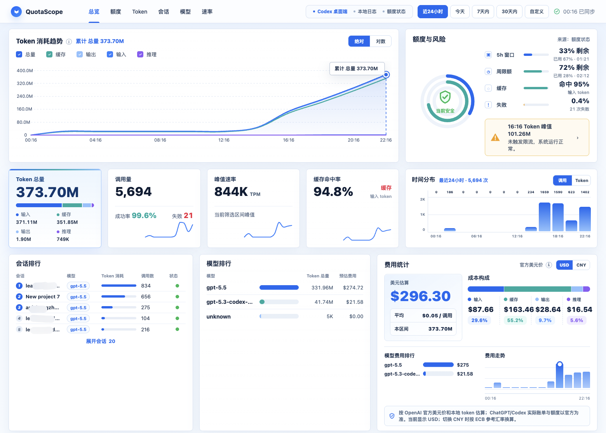

# CodexScope Live

[English](README.md) | 简体中文

CodexScope Live 是一个本地优先的 Codex 用量面板，用于查看本机 Codex 会话日志中的 Token 消耗、额度状态、模型分布、会话活跃度、调用分布、缓存命中率和费用估算。

## 原项目署名与许可证

本仓库是开源项目 **CodexScope** 的本地衍生和个人改造版本。原项目由 **[JUk1-GH](https://github.com/JUk1-GH)** 创建并发布。

- 原始仓库：[JUk1-GH/CodexScope](https://github.com/JUk1-GH/CodexScope)
- 原始许可证：[MIT](LICENSE)

本版本保留原项目署名和许可证，是独立的个人版本，不是上游仓库本身。

## 项目做什么

CodexScope Live 读取本机 Codex JSONL 会话日志中已经存在的用量元数据。它不连接 Codex 账号，不上传提示词，也不依赖托管后端。

项目提供两种使用方式：

| 模式 | 适用场景 | 工作方式 |
| --- | --- | --- |
| 静态预览 | 快速查看界面 | 直接打开 `index.html`；没有本地导出文件时使用内置示例数据。 |
| 本地实时面板 | Codex 运行期间持续观察用量 | Rust 服务负责托管页面、监控会话目录、重新生成本地导出，并通过服务器推送事件（SSE）通知浏览器刷新。 |

## 功能

- 输入、缓存、输出和推理 Token 的累计趋势
- 绝对值和对数图表视图
- 近 24 小时、今天、7 天、30 天和全部历史等日期预设
- 基于本地原始事件目录的自定义日期范围
- 调用次数和 Token 消耗分布图
- 从本地 `rate_limits` 事件读取额度与风险状态
- 会话排行和模型排行，支持本地搜索过滤
- 按模型和 Token 类型估算费用，支持 USD 和 CNY 展示
- 实时刷新开关、连接状态、手动刷新和滚动位置恢复
- 从 `~/.codex/sessions` 本地生成数据
- 桌面端优先的响应式界面，不使用托管遥测

## 快速开始

### 预览面板

只查看内置示例数据时不需要安装开发工具：

1. 下载或克隆本仓库。
2. 用浏览器打开 `index.html`。

通过 `file://` 打开时，页面会作为静态预览运行；这种方式不支持实时刷新。

### 在 Windows 上运行实时面板

Windows 启动脚本会在 `http://127.0.0.1:4173/` 启动本地 Rust 服务：

~~~text
windows/open-dashboard.cmd
~~~

可以双击脚本，也可以在终端中运行。脚本会优先使用本地已有的 `codexscope-live.exe`；找不到时回退到 `cargo run`。

从源码运行时，需要准备：

- Rust 和 Cargo，用于运行本地实时服务
- Go，除非项目中已经有预编译的 Go 数据生成器

Rust 服务默认监控以下 Codex 会话目录：

- macOS/Linux：`~/.codex/sessions`
- Windows：`%USERPROFILE%/.codex/sessions`

当 JSONL 会话文件发生变化时，服务会调用现有的 Go 生成器，并通过 SSE 向已连接的浏览器发送更新事件。在面板中启用实时模式后，页面会自动重新加载数据。

### 手动运行实时服务

在仓库根目录执行：

~~~powershell
cargo run --manifest-path ./live-server/Cargo.toml -- --root . --port 4173
~~~

常用参数：

~~~text
--root <path>          面板根目录，默认是当前目录
--sessions <path>      Codex 会话目录，默认使用当前平台的用户目录
--generator <path>     指定预编译数据生成器路径
--port <number>        本地 HTTP 端口，默认是 4173
--interval-ms <number> 轮询间隔，默认是 1000 ms
~~~

如果既没有预编译生成器，也没有安装 Go，服务仍然可以托管面板，但无法生成最新的本地用量导出。

## 手动生成本地数据

Go 生成器读取本机会话日志，并把浏览器使用的数据写到 `index.html` 所在目录：

~~~powershell
go run ./generate_codex_data.go --root "$env:USERPROFILE/.codex/sessions"
~~~

macOS 或 Linux：

~~~bash
go run ./generate_codex_data.go --root "$HOME/.codex/sessions"
~~~

生成文件说明：

- `data.js`：常用日期范围的预计算面板数据
- `data.raw.js`：自定义日期范围使用的压缩字典和原始事件行
- `.codexscope-cache.json`：增量解析缓存

这些文件可能包含私有项目名、会话 ID、时间戳、用量模式和额度元数据。它们已经被 `.gitignore` 排除；分享导出文件或截图前，请先自行检查内容。

## 本地开发

### 环境要求

- Node.js 和 npm：用于构建前端和执行视觉检查
- Rust 和 Cargo：用于构建实时服务
- Go：用于本地生成数据和构建 Release 生成器
- Playwright：执行响应式验证时使用，由 `npm install` 安装

### 安装与验证

~~~bash
npm install
npm run build:frontend
npm run check:live
npm run verify
~~~

构建 Rust 实时服务：

~~~bash
npm run build:live
~~~

Release 二进制会生成在 `live-server/target/release/`。在 Windows 上，启动脚本也会检查仓库根目录以及该目录中的 `codexscope-live.exe`。

现有 Release 脚本负责构建平台压缩包和预编译 Go 生成器：

~~~bash
npm run release:local
~~~

当前 Release 脚本还不会把 Rust 实时服务打进压缩包。需要实时功能时，请使用上面的源码运行方式，或者在发布前扩展打包步骤。

## 数据流

1. Codex 把本机会话日志写入对应平台的会话目录。
2. `generate_codex_data.go` 提取 Token 数量、模型名、会话 ID、耗时、失败状态和 rate-limit 元数据等用量信息。
3. 生成器把预计算视图写入 `data.js`，把压缩后的原始数据写入 `data.raw.js`。
4. 浏览器先加载示例数据；如果存在本地导出文件，再用真实数据覆盖示例数据。
5. 实时模式下，Rust 服务检测 JSONL 文件变化，重新生成导出文件，并通过 SSE 通知浏览器。
6. 图表、筛选、排行、额度状态和费用估算都在浏览器中计算。

生成器不会导出提示词、助手回复、工具输出或文件内容。

## 费用估算说明

费用卡片只是估算，不是官方账单。它使用本地 Token 数量和生成器导出的模型价格规则计算。USD 是原始计算币种，CNY 仅用于展示换算。

网络可用时，面板会通过 Frankfurter API 获取 USD/CNY 汇率，并使用 ECB 数据源；请求失败时会使用内置参考汇率，并在页面标记为离线回退。实际 ChatGPT 或 Codex 的账单、余额和额度状态，请以官方账号或账单页面为准。

## 项目结构

- `index.html`：面板外壳和交互控件
- `styles.css`：布局和视觉样式
- `app.ts`：图表、筛选、排行、额度显示和费用估算的 TypeScript 源码
- `app.js`：编译后的浏览器脚本
- `live.js`：浏览器端 SSE 客户端和实时刷新控制
- `live-server/`：负责静态文件、会话监控和 SSE 通知的 Rust 本地服务
- `generate_codex_data.go`：本地用量数据生成器
- `data.sample.js`：内置示例数据
- `macos/open-dashboard.command`：macOS 数据生成启动脚本
- `windows/open-dashboard.cmd`：Windows 实时服务启动脚本
- `scripts/build-release.sh`：分平台 Release 包构建脚本
- `verify_responsive.js`：基于 Playwright 的布局和交互检查
- `assets/`：截图和静态资源

## 当前限制

- 实时监控使用本地轮询，不是 Codex API 数据流；默认轮询间隔为 1 秒。
- 实时模式需要 Rust 服务，以及可用的 Go 生成器或预编译生成器。
- 只有本地会话日志包含相关 `rate_limits` 元数据时，页面才能显示额度和风险信息。
- 费用数据是估算值，不能当作账单记录。
- 服务只监听回环地址 `127.0.0.1`，设计目标是本机使用。

## 许可证

MIT，详见 [LICENSE](LICENSE)。
